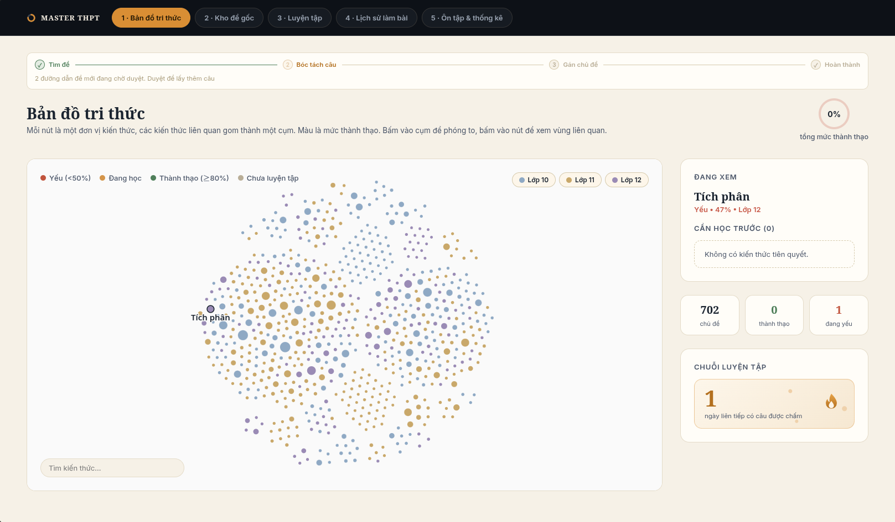
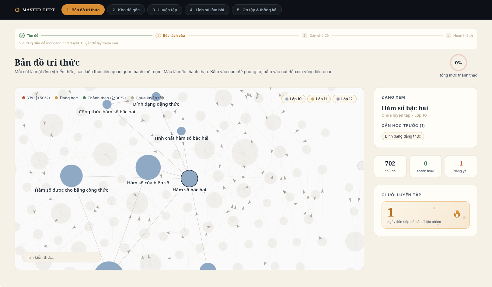
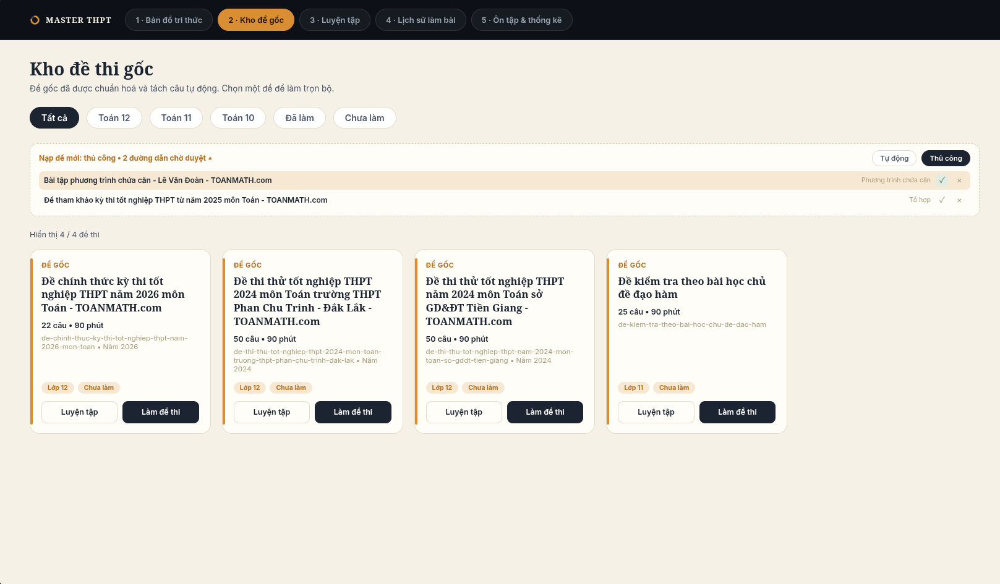
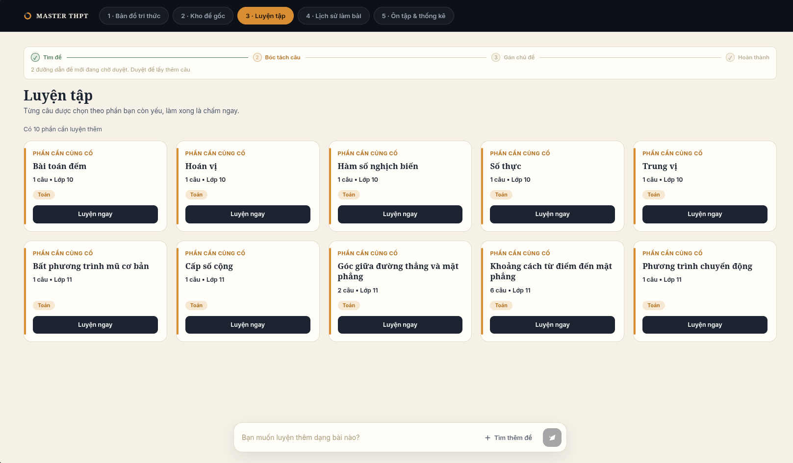
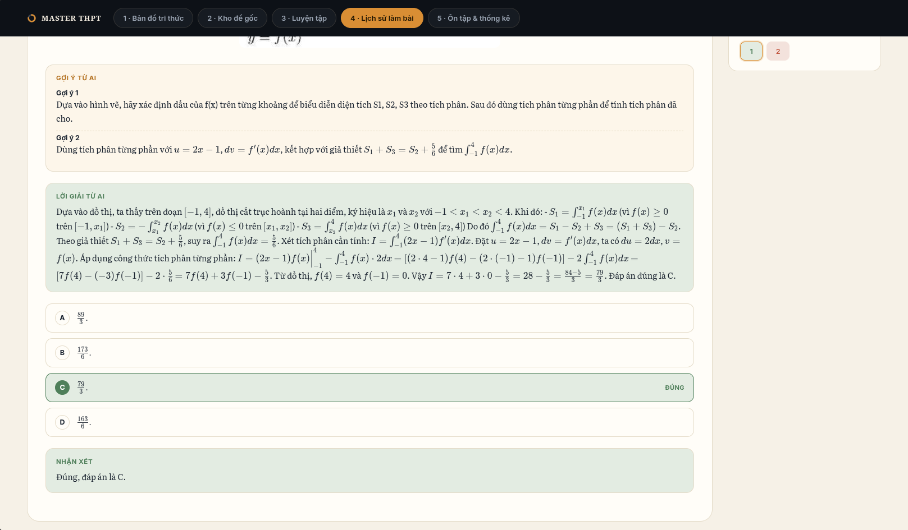
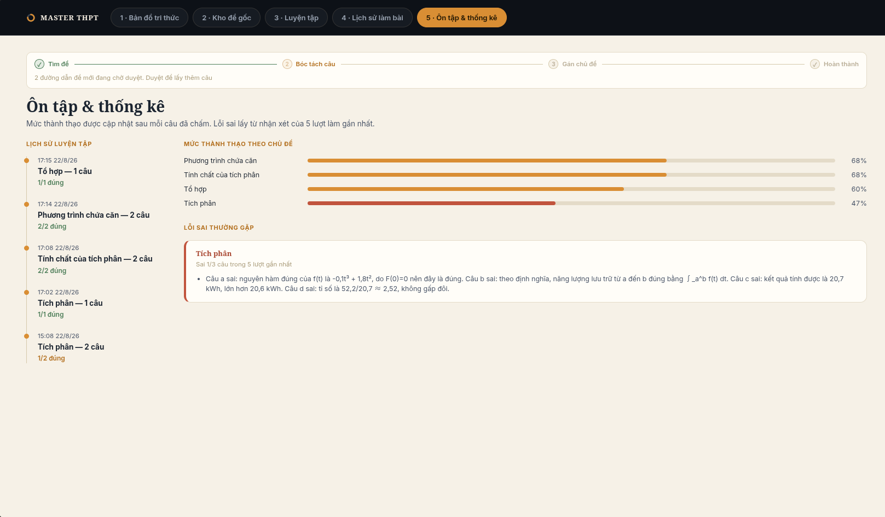
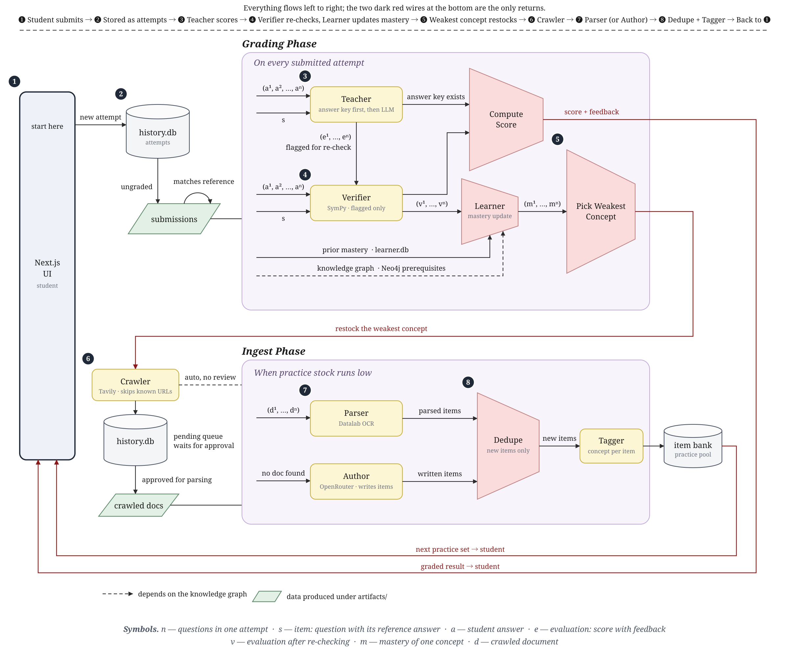

<div align="center">
  
  <h1>MASTER THPT</h1>
</div>

<p align="center">
  <b>A multi-agent maths tutor for Vietnamese high school.</b> Seven roles — four of them LLM-driven,
  the rest a search crawler, an OCR parser and a deterministic mastery tracker — crawl for exam papers,
  turn them into questions, grade what the student submits, re-check their own grading, and restock
  practice for whatever the learner is weakest at — on a 702-concept knowledge graph, with nobody
  queueing the work by hand.
</p>

<p align="center">
  
  
  
  
  
  
</p>

## Overview and Core Value Proposition

Vietnamese students preparing for the national maths exam do not lack exercises — they lack
exercises aimed at the exact thing they get wrong. MASTER THPT closes that loop end to end. Every
submitted answer is graded, re-checked, and turned into a mastery number for one specific concept on
the curriculum graph; the weakest concept immediately becomes the system's next crawl target. The
practice stock is a consequence of the learner's own mistakes rather than a fixed syllabus, and no
human queues any of it.

The whole system runs as two Python pipelines plus a Next.js front end. There is no orchestrator
service, no message broker and no per-student configuration: grading fans out over one attempt's
questions, and restocking runs in a background thread as soon as grading names a weak concept.

## Key Features and User Interface

- **Deterministic grading first.** The teacher matches the reference answer with a rubric and only
  spends an LLM call when the rubric cannot settle the question, so most marking costs nothing.
- **Self-checking.** Evaluations the teacher is unsure about are flagged and re-run by the verifier,
  which has SymPy on hand to decide algebraic equivalence.
- **Mastery on a real curriculum graph.** 702 concepts extracted from the grade 10–12 textbooks,
  810 prerequisite and taxonomy edges, queried live from Neo4j to find what to review first.
- **Practice that restocks itself.** Weak concept in, Tavily search out; new papers are OCR'd,
  deduplicated against the item bank, and tagged with one concept each. If nothing is found online,
  the author agent writes the missing questions.
- **Approval gate for ingest.** In manual mode crawled URLs queue up in the exam bank and wait for a
  human to approve them before anything is parsed.
- **Hints while working, solutions after grading.** Staged hints are available during an attempt; the
  full worked solution unlocks only once the answer has been marked.
- **Five screens, one flow.** Knowledge map → exam bank → practice → attempt history → review, each
  one reading the same artifacts the agents write.

## Screenshots

|  |  |
| --- | --- |
|  |  |
| **Knowledge map** — every concept in the grade 10–12 maths curriculum, clustered and coloured by mastery. The side panel shows the selected concept, its prerequisites and the practice streak. | **Cluster zoom** — click a cluster to open it and read the prerequisite arrows between individual concepts. |
|  |  |
| **Exam bank** — source exams after parsing, filterable by grade and by whether they have been attempted. Newly crawled URLs wait at the top for approval before anything is parsed. | **Practice** — one card per concept the learner is weak at, restocked in the background. Ask for a topic and the crawler goes looking for it. |
|  |  |
| **Graded attempt** — the hints that were offered, the full worked solution and per-option marking. The solution unlocks only after grading. | **Review** — mastery per concept, the attempt timeline, and the recurring mistakes distilled from the last five runs. |

## How one attempt travels through the system



The figure is generated from [`assets/workflow.html`](assets/workflow.html) — open it in a browser
for the vector version.

Two pipelines, and they only touch through the item bank and the learner's mastery table:

**Grading.** A submitted attempt is stored in `history.db`, then `grade()` runs the teacher, the
verifier and the learner in that order. The teacher tries the rubric first (`match_answer`) and only
calls an LLM when the reference answer cannot settle the question; evaluations it is not confident
about are flagged. The verifier re-checks *only* the flagged ones, with SymPy available as a tool for
algebraic equivalence. The learner writes one mastery update per concept mapped to each graded
question, then picks the weakest concept touched by the attempt and kicks off restocking in a
background thread.

**Ingest.** Restocking asks the crawler for material on that concept. Tavily searches, already-known
URLs are skipped. Found documents go through Datalab OCR in the parser; if nothing is found at all
the author writes the missing questions instead. Either way the result is deduplicated against
`item_bank.jsonl` by fingerprint, and only genuinely new items are sent to the tagger — so
re-ingesting a document costs no LLM calls. The tagger maps each item to exactly one knowledge node,
which is what makes the mastery bookkeeping one-update-per-question.

## Agents and pipeline stages

Four of the seven reason with a model. The crawler and the parser do call services with models inside
them — Tavily's ranking, Datalab's OCR and image captions — but neither ever asks a model to choose:
which URL survives and where one question ends are regex decisions, made here. The learner touches no
model at all; its mastery numbers are arithmetic over SQLite.

| Role | Code | Decided by | What it does |
| --- | --- | --- | --- |
| **Teacher** | `backend/agents/teacher` | LLM | Rubric match first, LLM evaluation second; flags what needs review. |
| **Author** | `backend/agents/teacher` (`write_questions`) | LLM | Writes items from scratch when the crawler comes back empty. |
| **Verifier** | `backend/agents/verifier` | LLM + SymPy | Re-checks flagged evaluations only, with SymPy tools. |
| **Tagger** | `backend/knowledge/bank/tagger` | LLM | Maps each new item to exactly one knowledge node, in batches of `TAGGER_BATCH_SIZE`. |
| **Crawler** | `backend/agents/crawler` | Tavily API | Search + fetch for a concept, excluding URLs already in the bank. |
| **Parser** | `backend/agents/parser` | Datalab OCR | PDF/Word → OCR → one `refined.json` per document. |
| **Learner** | `backend/agents/learner` | Deterministic | Mastery arithmetic per concept, next-action recommendation, weakest-concept selection. No model call. |

Grading fans out across questions with a thread pool (`MAX_GRADING_WORKERS`), and every LLM call is
traced to LangSmith.

## Data stores

| Path | Contents |
| --- | --- |
| `artifacts/history/history.db` | Attempts, per-question answers, and the crawl queue waiting for approval. |
| `artifacts/learner/learner.db` | `knowledge_state` (mastery, attempts, correct/incorrect) and `question_knowledge` (item → concept). |
| `artifacts/item_bank.jsonl` | The practice pool. Append-only, deduplicated by fingerprint. |
| `artifacts/data/<document>/` | `raw.json`, `refined.json` and extracted images per source document. |
| `artifacts/knowledge_graph/knowledge_graph.json` | The graph itself: 702 concepts, 810 edges. |
| Neo4j Aura | The same graph, queried live for prerequisites and dependents. |

## Knowledge graph

702 concepts (250 in grade 10, 308 in grade 11, 144 in grade 12) and 810 edges: 564 `REQUIRES`,
157 `IS_A`, 76 `PART_OF`, 13 `SUBSET_OF`.

It is built offline from the textbook PDFs in `artifacts/textbooks/raw`, not at startup. Each stage
caches into `artifacts/knowledge_graph/` so a rerun only pays for what changed:

```bash
cd backend
python -m knowledge.graph.refine        # PDF -> Datalab OCR -> refined Markdown
python -m knowledge.graph.chunk         # split into lessons
python -m knowledge.graph.extract       # lesson -> concepts + local edges
python -m knowledge.graph.canonicalize  # merge duplicate concepts across books
python -m knowledge.graph.link          # global prerequisite edges, cycle resolution
python -m knowledge.graph.convert       # export CSVs for Neo4j Aura import
python -m scripts.validate_graph
```

The app reads `knowledge_graph.json` for node lists and the knowledge-map UI, and Neo4j for
prerequisite traversal.

## API

FastAPI, everything under `/api`:

| Route | Purpose |
| --- | --- |
| `GET /api/documents`, `GET /api/documents/{id}` | Exam bank and one exam's items. |
| `GET/POST/DELETE /api/ingest`, `POST /api/ingest/mode`, `POST /api/ingest/approve` | The manual crawl queue: inspect, switch auto/manual, drop or approve a URL. |
| `GET /api/practice`, `GET /api/practice/status`, `POST /api/practice/update` | Practice sets, background stocking progress, request a topic. |
| `POST /api/exams/submit`, `GET /api/exams/grading-status` | Submit an attempt, poll grading. |
| `POST /api/practice/check-question` | Grade a single practice question. |
| `POST /api/hints`, `POST /api/solutions` | Staged hints while working; worked solutions only once the answer is graded. |
| `POST /api/history`, `GET /api/history`, `GET /api/history/{id}` | Attempt history. |
| `GET /api/knowledge_graph` | The graph overlaid with the learner's mastery. |

## Local development

Two processes: FastAPI on port 8000 and Next.js on port 3000. The browser only ever talks to port
3000 — every call goes through the frontend's own `/api/[...path]` route, which proxies to the
backend.

1. **Environment:**
```bash
cp .env.example .env
echo 'API_PROXY_TARGET=http://localhost:8000' > frontend/.env.local
```
Fill `.env` with your Tavily, Datalab, OpenRouter, LangSmith and Neo4j credentials. Every tuning knob
lives there too — crawler page limits, grading concurrency, mastery rates and thresholds, practice
stocking size.

2. **Backend:**
```bash
cd backend
uv venv
uv pip install -r requirements.txt
.venv/bin/python -m api.router
```

3. **Frontend:**
```bash
cd frontend
npm install
npm run dev
```

4. **Tests:**
```bash
cd backend && .venv/bin/python -m pytest -q
```

## Tech stack

| Layer | Technology |
| --- | --- |
| **Frontend** | Next.js 14 App Router, React 18, TypeScript, KaTeX, `react-force-graph-2d` + `d3-force` |
| **Backend** | Python 3.12, FastAPI, Uvicorn, Pydantic |
| **Agents** | OpenRouter (per-role models), LangSmith tracing, SymPy, Tavily, Datalab OCR |
| **Storage** | SQLite (`history.db`, `learner.db`), JSONL item bank, Neo4j Aura |

## Repository layout

```
.
├── backend/                                # FastAPI service, port 8000
│   ├── main.py                             # grade(), ingest(), stock_practice()
│   ├── api/                                # every /api route and its schemas
│   ├── agents/
│   │   ├── crawler/                        # Tavily search, skips known URLs
│   │   ├── parser/                         # Datalab OCR, then split into items
│   │   ├── teacher/                        # rubric first, then LLM; also writes items
│   │   ├── verifier/                       # re-checks flagged evaluations with SymPy
│   │   └── learner/                        # mastery, learning path, restock requests
│   ├── knowledge/
│   │   ├── bank/                           # dedupe, append, one concept per item
│   │   └── graph/                          # offline graph build, Neo4j queries, textbook PDFs
│   ├── history/                            # attempts and the crawl queue
│   ├── common/                             # shared schemas, LLM and JSON helpers
│   ├── scripts/                            # graph validation and stats
│   ├── tests/                              # pytest
│   └── requirements.txt
├── frontend/                               # Next.js 14, port 3000
│   ├── app/
│   │   ├── api/[...path]/                  # proxy to the backend
│   │   ├── knowledge_graph/                # the concept map
│   │   ├── documents/                      # exam bank, crawl queue approval
│   │   ├── exams/[id]/                     # sitting an exam
│   │   ├── practice/                       # per-concept practice cards
│   │   ├── history/[id]/                   # graded attempt, hints, solution
│   │   └── review/                         # mastery and recurring mistakes
│   ├── features/                           # page-level components
│   └── shared/                             # api client and styles
├── artifacts/
│   ├── data/                               # raw.json, refined.json, images per document
│   ├── textbooks/                          # raw and refined Markdown
│   ├── knowledge_graph/                    # stage caches, knowledge_graph.json, neo4j CSVs
│   ├── history/                            # history.db
│   ├── learner/                            # learner.db
│   └── item_bank.jsonl                     # the practice pool
├── assets/                                 # screenshots, workflow.png and workflow.html
├── .env.example                            # keys and tuning knobs
└── README.md
```

## Contributors

We welcome and appreciate all contributions to the MASTER THPT platform. Thank you to everyone who has helped build this project!

[](https://github.com/khang1108/MASTER---Multi-Agent-System-for-Teaching-Evaluating-Reviewing/graphs/contributors)

<p align="left">
  <a href="https://github.com/khang1108/masterTHPT/graphs/contributors">
  
  </a>
</p>

## License

MIT, covering the code in this repository. Exam papers, textbook extracts and anything else under
`artifacts/` stay with their original owners and are not licensed here.
